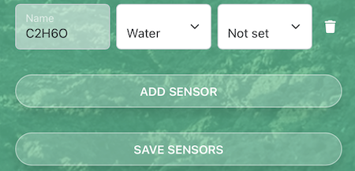

# API docs

This document describes the HTTP API that can be used to [send measurements](#sending-measurements-to-the-database) to the database and how to [retrieve them](#retrieving-measurment-data-from-the-database).

## Sending measurements to the database

The `tacserial.py` python script connects to the Arduino to forward the data, but if you want you can also create your own client.

First find the `API_KEY` of your kit, it can be retrieved from the configuration page of your kit on `https://kits.teleagriculture.org/`.

Whenever you want to send a measurement you have to make a `POST` request to `https://kits.teleagriculture.org/api/kits/[KIT_ID]/measurements`. This request should have an `Authorization` header with a `Bearer [API_KEY]` value to authorize the request.

The data should be posted as a `json` body with the **name** of the sensor as key and the measurement as (numeric) value. You don't have to submit a value for all sensors, so if you have a custom sensor running you can also submit only that value. An example payload could be:

```json
{
  "ftTemp": 22.2,
  "gbHum": 51
}
```

If a sensor name can not be found on the kit it will be (silently) ignored.

### Custom sensors

All kits get a default set of sensors associated to them on the database. However if you have the admin rights on a kit you can configure additional custom sensors, on the configuration page of your kit. Note that the **name** of the sensor is used to match, so make sure to use the same name when adding the sensor on the website and when posting the measurements.
For example you can add a sensor with the name C2H6O:



Then `POST` this as json payload to send a measurement for it

```json
{
  "C2H6O": 13.3
}
```

## Retrieving measurment data from the database

There are a couple of ways to retrieve sensor measurement data from the database through the API.

For now these GET endpoints do not require authentication.
~~All API endpoints require the API Key as a bearer token, i.e. a header with name `Authorization` and value `Bearer [API_KEY]`, where `[API_KEY]` is the API Key for the kit. Most http clients have an easy way to set this header.~~

The output is always JSON formatted with the primary results in the top-level `data` key. Additional metadata like pagination is also available top-level. See below for examples.

Note that each sensor has its own history of measurements, so there is no concept of a set of latest measurements per kit. The latest_measurement on the kit level is just the last recorded measurment on any of its sensors.

### Get kit info including latest measurement per sensor

This includes all sensors that are configured on the kit, so including strip testing measurements. Note that it is possible that no measurements were ever recorded for a sensor, in that case the `latest_measurement` for the sensor will be omitted or set to `null`.

> `https://kits.teleagriculture.org/api/kits/[KIT_ID]`
>
> `[KIT_ID]`: the kit id you are targeting.

Example output:

```json
{
  "data": {
    "id": 1001,
    "name": "V2_Lab",
    "location": "Rotterdam, NL",
    "latest_measurement": {
      "created_at": "2019-09-25T16:00:00.000000Z",
      "value": 22.31
    },
    "sensors": [
      {
        "id": 56,
        "name": "ftTemp",
        "group": "Water",
        "unit": "celcius",
        "latest_measurement": {
          "created_at": "2019-09-25T16:00:00.000000Z",
          "value": 22.31
        }
      },
      {
        "id": 57,
        "name": "gbHum",
        "group": "Air",
        "unit": null,
        "latest_measurement": {
          "created_at": "2019-09-25T16:00:00.000000Z",
          "value": 52.2
        }
      }
      // etcetera
    ]
  }
}
```

### GET history of sensor measurements

> `https://kits.teleagriculture.org/api/kits/[KIT_ID]/[SENSOR_NAME]/measurements`
>
> `[KIT_ID]`: the kit id you are targeting.
> `[SENSOR_NAME]`: the name of the sensor, e.g. co or ftTemp (case insensitive)

This outputs the latest 30 measurements by default. To change the amount add a query parameter of the form `page[size]=50`.

To go to the next page we use cursor pagination. In the output there is a `meta` object on the top-level, in it there is a value for `next_cursor` and `prev_cursor` (only if there are results after or before the current page). Add this cursor as a query parameter as well, e.g. `page[cursor]=eyJj...LONGSTRING`.

Example output for kit `1001` and sensor `co`, i.e. URL: `https://kits.teleagriculture.org/api/kits/1001/co/measurements`

```json
{
  "data": [
    {
      "created_at": "2019-09-25T16:00:00.000000Z",
      "value": 4.34
    },
    {
      "created_at": "2019-09-25T15:00:00.000000Z",
      "value": 4.34
    },
    {
      "created_at": "2019-09-25T14:00:00.000000Z",
      "value": 4.34
    },
    // etcetera
    {
      "created_at": "2019-09-24T11:00:00.000000Z",
      "value": 4.34
    }
  ],
  // instead of the cursor you can also directly use the links
  "links": {
    "first": null,
    "last": null,
    "prev": null,
    "next": "http://localhost:8005/api/kits/1001/co/measurements?page%5Bcursor%5D=eyJjcmVhdGVkX2F0IjoiMjAxOS0wOS0yNCAxMTowMDowMCIsImlkIjoxNTM1NywiX3BvaW50c1RvTmV4dEl0ZW1zIjp0cnVlfQ"
  },
  "meta": {
    "path": "http://localhost:8005/api/kits/1001/co/measurements",
    "per_page": 30,
    "next_cursor": "eyJjcmVhdGVkX2F0IjoiMjAxOS0wOS0yNCAxMTowMDowMCIsImlkIjoxNTM1NywiX3BvaW50c1RvTmV4dEl0ZW1zIjp0cnVlfQ",
    "prev_cursor": null
  }
}
```

In this example the next page or results could be retrieved on this URL: `https://kits.teleagriculture.org/api/kits/1001/co/measurements?page[cursor]=eyJjcmVhdGVkX2F0IjoiMjAxOS0wOS0yNCAxMTowMDowMCIsImlkIjoxNTM1NywiX3BvaW50c1RvTmV4dEl0ZW1zIjp0cnVlfQ`

### GET daily average, minimum, maximum per week or month

> `https://kits.teleagriculture.org/api/kits/[KIT_ID]/[SENSOR_NAME]/measurements/[PERIOD]?page[cursor]=[DATE]`
>
> `[KIT_ID]`: the kit id you are targeting.
> `[SENSOR_NAME]`: the name of the sensor, e.g. co or ftTemp (case insensitive)
> `[PERIOD]`: week, month or year, where month is actually 4 weeks.
> `[DATE]`: till what date to search

This outputs the latest 30 measurements by default. To change the amount add a query parameter of the form `page[size]=50`.

To go to the next page we use cursor pagination. In the output there is a `meta` object on the top-level, in it there is a value for `next_cursor` and `prev_cursor` (only if there are results after or before the current page). Add this cursor as a query parameter as well, e.g. `page[cursor]=eyJj...LONGSTRING`.

Example output for kit `1001`, sensor `co`, period of a `month` up to `2019-08-29` so the URL: `https://kits.teleagriculture.org/api/kits/1001/co/measurements/month?page[cursor]=2019-08-29`

Note that if there are no measurements on a day, the value `null` is returned for `avg`, `min`, and `max`.

If there are no measurements at all before the given `[DATE]` then no data will be returned and the response status code will be `404 Not Found`.

```json
{
  "data": [
    {
      "date": "2019-08-02",
      "weekday": 5,
      "avg": null,
      "min": null,
      "max": null
    },
    {
      "date": "2019-08-03",
      "weekday": 6,
      "avg": null,
      "min": null,
      "max": null
    },
    // etcetera
    {
      "date": "2019-08-28",
      "avg": 4.41068333,
      "min": 4.3468,
      "max": 4.5595,
      "weekday": 3
    },
    {
      "date": "2019-08-29",
      "avg": 4.4368625,
      "min": 4.2442,
      "max": 4.5697,
      "weekday": 4
    }
  ],
  "meta": {
    "to": "2019-08-29",
    "from": "2019-08-02",
    "next_cursor": "2019-09-26",
    "prev_cursor": "2019-08-01"
  }
}
```

The `meta` at the bottom holds the next and previous cursor.
